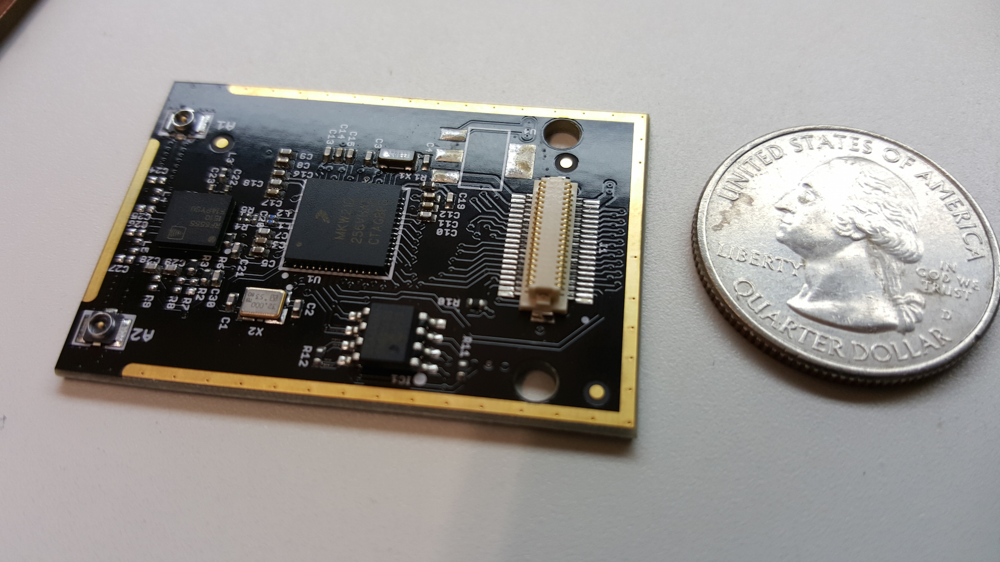

# ZeroDiff

[View the latest posts](blog/index.md).

## A New Way to Design and Develop Products

### A Simple Philosophy

>If you maintain zero difference between prototype and production designs, you can release or mass produce any revision even when you iterate designs rapidly.

### Corollary

>Always manufacture prototype and production designs with the same process and tooling - **always**.

## Overview

### Philosophy

If you maintain zero difference between prototype and production, you can release any revision even when iterating rapidly.

### Impact

- For Software: your dev cluster *is* production. Every commit can go live.
- For Hardware: your enclosures and PCBs use production tooling. Every revision is manufacturing-ready.

### Result

Iterate with real users in days, not months. No "big bang" releases. Scale at any moment.

---

## Explore

Here are a couple of ways that you can explore the concepts:

**New to ZeroDiff**: Start with [Principles](about/why.md)

**Dive deep**: [Hardware](hardware/index.md) or [Software](software/index.md) guides

**Follow the journey**: [Posts](blog/index.md)
